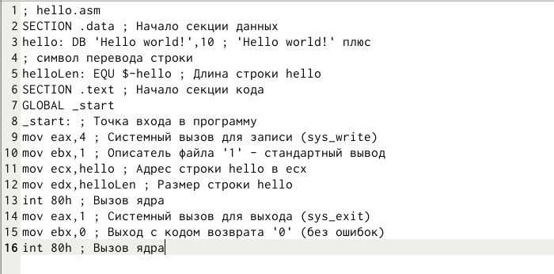
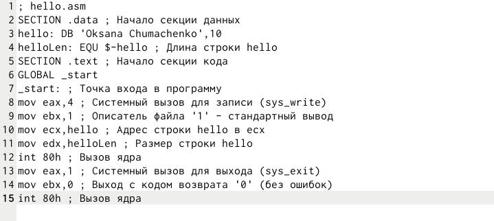
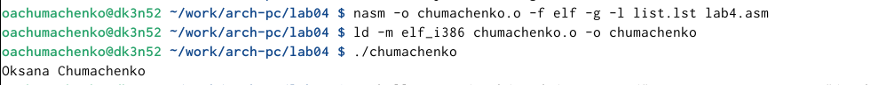
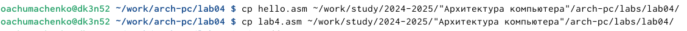

---
## Front matter
title: "Лабораторная работа №4"
subtitle: "Создание и процесс обработки программ на языке ассемблера NASM"
author: "Оксана Алексеевна Чумаченко"

## Generic otions
lang: ru-RU
toc-title: "Содержание"

## Bibliography
bibliography: bib/cite.bib
csl: pandoc/csl/gost-r-7-0-5-2008-numeric.csl

## Pdf output format
toc: true # Table of contents
toc-depth: 2
lof: true # List of figures
lot: true # List of tables
fontsize: 12pt
linestretch: 1.5
papersize: a4
documentclass: scrreprt
## I18n polyglossia
polyglossia-lang:
  name: russian
  options:
	- spelling=modern
	- babelshorthands=true
polyglossia-otherlangs:
  name: english
## I18n babel
babel-lang: russian
babel-otherlangs: english
## Fonts
mainfont: IBM Plex Serif
romanfont: IBM Plex Serif
sansfont: IBM Plex Sans
monofont: IBM Plex Mono
mathfont: STIX Two Math
mainfontoptions: Ligatures=Common,Ligatures=TeX,Scale=0.94
romanfontoptions: Ligatures=Common,Ligatures=TeX,Scale=0.94
sansfontoptions: Ligatures=Common,Ligatures=TeX,Scale=MatchLowercase,Scale=0.94
monofontoptions: Scale=MatchLowercase,Scale=0.94,FakeStretch=0.9
mathfontoptions:
## Biblatex
biblatex: true
biblio-style: "gost-numeric"
biblatexoptions:
  - parentracker=true
  - backend=biber
  - hyperref=auto
  - language=auto
  - autolang=other*
  - citestyle=gost-numeric
## Pandoc-crossref LaTeX customization
figureTitle: "Рис."
tableTitle: "Таблица"
listingTitle: "Листинг"
lofTitle: "Список иллюстраций"
lotTitle: "Список таблиц"
lolTitle: "Листинги"
## Misc options
indent: true
header-includes:
  - \usepackage{indentfirst}
  - \usepackage{float} # keep figures where there are in the text
  - \floatplacement{figure}{H} # keep figures where there are in the text
---

# Цель работы

Освоение процедуры компиляции и сборки программ, написанных на ассемблере NASM.

# Задание

1. Программа Hello world!

1.1 создать каталог для работы с программами на языке ассемблера NASM

1.2 перейти в созданный каталог

1.3 создать текстовый файл с именем hello.asm

1.4 открыть этот файл

1.5 ввести в него указанный текст

2. Транслятор Nasm

2.1 выполнить комппиляцию в объектный код

3. Расширенный синтаксис

3.1 выполнить компиляцию исходного файла

4. Компановщик LD

4.1 передать объектный файл на обработку компановщику

5. Запустить исполняемый файл

6. Задания для самостоятельной работы

6.1 создать копию файла hello.asm с именем lab4.asm

6.2 изменить скопированный файл, чтобы выводилась строка с именем и фамилией

6.3 оттранслировать полученный текст программы lab4.asm в объектный файл

6.4 скопировать файлы hello.asm и lab4.asm в локальный репозиторий

# Теоретическое введение

Здесь описываются теоретические аспекты, связанные с выполнением работы.

Например, в табл. [-@tbl:std-dir] приведено краткое описание стандартных каталогов Unix.

: Описание некоторых каталогов файловой системы GNU Linux {#tbl:std-dir}

| Имя каталога | Описание каталога                                                                                                          |
|--------------|----------------------------------------------------------------------------------------------------------------------------|
| `/`          | Корневая директория, содержащая всю файловую                                                                               |
| `/bin `      | Основные системные утилиты, необходимые как в однопользовательском режиме, так и при обычной работе всем пользователям     |
| `/etc`       | Общесистемные конфигурационные файлы и файлы конфигурации установленных программ                                           |
| `/home`      | Содержит домашние директории пользователей, которые, в свою очередь, содержат персональные настройки и данные пользователя |
| `/media`     | Точки монтирования для сменных носителей                                                                                   |
| `/root`      | Домашняя директория пользователя  `root`                                                                                   |
| `/tmp`       | Временные файлы                                                                                                            |
| `/usr`       | Вторичная иерархия для данных пользователя                                                                                 |

Более подробно про Unix см. в [@tanenbaum_book_modern-os_ru; @robbins_book_bash_en; @zarrelli_book_mastering-bash_en; @newham_book_learning-bash_en].

# Выполнение лабораторной работы

1. Создайте каталог для работы с программами на языке ассемблера NASM

{#fig:001 width=80%}

2. Перейдём в созданный каталог

{#fig:002 width=80%}

3. Создадим текстовый файл с именем hello.asm

{#fig:003 width=80%}

4. Откроем этот файл с помощью текстового редактора

{#fig:004 width=80%}

5. Введём в него текст:

{#fig:005 width=80%}

6. Скомпилируем данный текст

{#fig:006 width=80%}

7. Проверим, что объектный файл был создан:

{#fig:007 width=80%}

8. Скомпилируем исходный файл hello.asm в obj.o и создадим файл листинга list.lst

{#fig:008 width=80%}

9. Проверим, что файлы были созданы

{#fig:009 width=80%}

10. Передаем объектный файл на обработку компоновщику для получения исполняемой программы

{#fig:010 width=80%}

11. Проверим, что исполняемый файл hello был создан

{#fig:011 width=80%}

12. Зададим имя создаваемого исполняемого файла

{#fig:012 width=80%}

13. Запустим на выполнение созданный исполняемый файл, находящийся в текущем каталоге.

{#fig:013 width=80%}

14. Создадим копию файла hello.asm с именем lab4.asm

{#fig:014 width=80%}

15. Внесём изменения в текст программы в файле lab4.asm

{#fig:015 width=80%}

16. Оттранслируем полученный текст программы lab4.asm в объектный файл 
Выполним компоновку объектного файла и запустим получившийся исполняемый файл

{#fig:016 width=80%}

17. Скопировала файлы hello.asm и lab4.asm в локальный репозиторий в каталог ~/work/study/2024-2025/“Архитектура компьютера”/arch-pc/labs/lab04/ с помощью утилиты ср 

{#fig:017 width=80%}

18. Загружаю файлы на Github

# Выводы

В ходе выполнения работы, я освоила процедуры компиляции и сборки программ, написанных на ассемблере NASM

# Список литературы

::: {#refs}
:::

